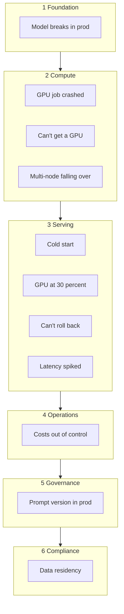

# Cloud Native for AI Developers: A Pain-First Field Guide

Cloud native is the operating system for production software. AI development grew up parallel to it, mostly in notebooks and on rented GPU boxes. That's changed. Inference at scale, multi-agent systems, enterprise rollouts. The walls between an experiment and a system are coming down, and on the other side of those walls is a vocabulary AI developers haven't had to learn yet.

This guide is that vocabulary, pain-first. Each pain starts with a problem you've hit or are about to, names what's actually happening, and points at the cloud native primitive that solves it. Read in order, or jump to the one biting you this week.

What this guide is not: a Kubernetes tutorial. There are 500 of those. This is a translation between two worlds that increasingly need each other, with an honest accounting of where the translation runs out.

## The mental model shift

Before any specific primitive, the reframe:

| From (your world) | To (cloud native) | The shift |
|---|---|---|
| Notebook kernel on your laptop | Pod: ephemeral, scheduled, identical to N others | Compute is interchangeable |
| `python serve.py` (an invocation) | Deployment: declared state of N replicas, platform keeps it true | Imperative becomes declarative |
| Local file on a disk you own | Volume: survives the pod, lives on infrastructure, mounted in | Storage outlives compute |
| `.env` with `HF_TOKEN` in plain text | Secret: scoped, rotated, audited | Secrets are first-class, not afterthoughts |
| "It works on my machine" | Container image: identical run, everywhere | The artifact is the contract |

The shift, in one line: invoke less, declare more.

## The pains

Eleven pains, sequenced from foundation to compliance.

### Foundation
- [Model works locally, breaks in prod](pains/01-model-works-locally.md)

### Compute
- [My GPU job crashed at hour 14 and I lost everything](pains/02-gpu-job-crashed.md)
- [I can't get a GPU when I need one](pains/03-cant-get-a-gpu.md)
- [Multi-node training keeps falling over](pains/04-multi-node-training.md)

### Serving
- [Cold start for my 70B model takes 4 minutes](pains/05-cold-start.md)
- [My GPU sits at 30% but my bill says 100%](pains/06-gpu-underutilized.md)
- [I can't roll back a bad model without downtime](pains/07-cant-roll-back.md)
- [Inference latency spiked and I can't tell why](pains/08-latency-spiked.md)

### Operations
- [Costs are out of control](pains/09-costs-out-of-control.md)

### Governance
- [I can't tell which prompt version is in prod](pains/10-prompt-version.md)

### Compliance
- [Customer X's data can't leave their region](pains/11-data-residency.md)

## Reference

- [The Rosetta table](reference/rosetta-table.md): one-to-one mappings between your world and cloud native
- [Where cloud native doesn't help](reference/where-cn-doesnt-help.md): honest scope statement on what this guide doesn't cover
- [What not to translate](reference/what-not-to-translate.md): cloud native dogma that bends or breaks for AI workloads
- [Reading path](reference/reading-path.md): five things to actually touch, in order

## Examples

Runnable manifests, scripts, and starter code per pain. See [examples/](examples/). Filled in pain-by-pain as the guide evolves.

## Contributing

Feedback, corrections, and additional pains welcome. See [CONTRIBUTING.md](CONTRIBUTING.md).

## Closing

Cloud native didn't ask the AI world's permission to become a prerequisite. It just became one, the moment AI workloads started serving real traffic, sharing real infrastructure, and shipping to real customers. The patterns are the same ones that took the rest of the industry from "it works on my laptop" to "it works for ten million users." They translate, mostly cleanly, with a handful of honest exceptions called out in the [reference section](#reference).

The faster the translation happens, the faster AI in production stops being heroic and starts being boring. Boring is the goal.

## License

Licensed under [Apache-2.0](LICENSE).
