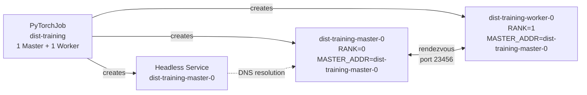

# After: the cloud native way

Same training simulation, submitted as a [PyTorchJob](https://www.kubeflow.org/docs/components/training/pytorch/)
via the [Kubernetes Training Operator](https://github.com/kubeflow/training-operator).

The operator creates all pods together, injects `MASTER_ADDR`, `RANK`, and `WORLD_SIZE`
automatically, and handles failure semantics at the distributed-job level. The
rendezvous succeeds. Training completes.

## Prerequisites

- [Docker](https://docs.docker.com/get-docker/) (tested with 29+)
- [kubectl](https://kubernetes.io/docs/tasks/tools/)
- A running Kind cluster (`kind create cluster` if you don't have one)
- [kind CLI](https://kind.sigs.k8s.io/docs/user/quick-start/#installation)

## 1. Install the Training Operator

```bash
kubectl apply -k "github.com/kubeflow/training-operator/manifests/overlays/standalone?ref=v1.8.1"
```

Wait for the controller to be ready:

```bash
kubectl rollout status deployment/training-operator -n kubeflow
```

## 2. Build and load the image

```bash
./build.sh
```

This builds `dist-training:latest` and loads it directly into your Kind cluster.
No registry needed.

Verify the image is loaded:

```bash
docker exec -it $(kind get nodes --name $(kind get clusters | head -1)) crictl images | grep dist-training
```

## 3. Submit the PyTorchJob

```bash
kubectl apply -f pytorchjob.yaml
```

The Training Operator creates two pods simultaneously: a master (rank 0) and a
worker (rank 1), and injects the rendezvous coordinates into both.

## 4. Watch the run

Check job status:

```bash
kubectl get pytorchjob dist-training
```

```
NAME            STATE     AGE
dist-training   Running   10s
```

List the pods:

```bash
kubectl get pods -l training.kubeflow.org/job-name=dist-training
```

```
NAME                       READY   STATUS    RESTARTS   AGE
dist-training-master-0     1/1     Running   0          12s
dist-training-worker-0     1/1     Running   0          12s
```

Both pods started at the same time. Tail the master's logs:

```bash
kubectl logs -f dist-training-master-0
```

```
[rank 0] Starting. WORLD_SIZE=2 MASTER=dist-training-master-0:23456
[rank 0] Opening rendezvous on :23456. Waiting up to 60s for 1 worker(s) ...
[rank 0] Worker connected from ('10.244.0.8', 54321)
[rank 0] All 2 rank(s) ready. Starting distributed training.
[rank 0] epoch   0/10  loss=2.3000
[rank 0] epoch   1/10  loss=1.8769
...
[rank 0] Training complete.
```

Tail the worker's logs:

```bash
kubectl logs -f dist-training-worker-0
```

```
[rank 1] Starting. WORLD_SIZE=2 MASTER=dist-training-master-0:23456
[rank 1] Connecting to master at dist-training-master-0:23456 (timeout: 60s) ...
[rank 1] Rendezvous complete. Starting distributed training.
[rank 1] epoch   0/10  loss=2.3000
...
[rank 1] Training complete.
```

Once both pods finish, the job transitions to `Succeeded`:

```bash
kubectl get pytorchjob dist-training
```

```
NAME            STATE       AGE
dist-training   Succeeded   45s
```

## 5. Simulate a worker failure

While the job is running, delete the worker pod:

```bash
kubectl delete pod dist-training-worker-0
```

The Training Operator's `restartPolicy: OnFailure` creates a replacement pod immediately.
The new worker reconnects to the master's rendezvous server (which is still running),
and training continues from where it left off without restarting the master.

Watch the new pod appear:

```bash
kubectl get pods -l training.kubeflow.org/job-name=dist-training -w
```

## 6. Clean up

```bash
kubectl delete -f pytorchjob.yaml
```

To remove the Training Operator:

```bash
kubectl delete -k "github.com/kubeflow/training-operator/manifests/overlays/standalone?ref=v1.8.1"
```

## How the pieces fit together



The operator owns the lifecycle. Both pods are created atomically. If either fails,
`restartPolicy: OnFailure` replaces it without touching the other.

## What the manifests declare

| Field | What it does |
|---|---|
| `Master.replicas: 1` | One coordinator pod (rank 0). Gets a stable hostname the workers can resolve. |
| `Worker.replicas: 1` | One worker pod (rank 1). Scales to N for multi-node runs. |
| `restartPolicy: OnFailure` | Replace a failed pod without restarting the whole job. |
| `imagePullPolicy: Never` | Use the image loaded directly into Kind — no registry needed. |

The Training Operator adds `MASTER_ADDR`, `MASTER_PORT`, `RANK`, and `WORLD_SIZE` to
every container automatically. **The training code doesn't change.**

## What this maps to on a real GPU cluster

| This demo | Real GPU job |
|---|---|
| `python:3.11-slim` base | CUDA base image (`nvcr.io/nvidia/pytorch:24.05-py3`) |
| Socket rendezvous | NCCL / `torch.distributed.init_process_group` |
| Fake loss loop | Actual model forward/backward pass |
| `Worker.replicas: 1` | `Worker.replicas: 31` (4× 8-GPU nodes = 32 ranks) |
| Kind node | A100 / H100 GPU node with InfiniBand or RoCE networking |
| `kubectl delete pod` | Node failure, spot-instance reclaim, GPU ECC error |
| `restartPolicy: OnFailure` | Same — one bad node restarts without losing the other 31 |

For true gang scheduling (all-or-nothing pod admission), combine PyTorchJob with
[Kueue](https://kueue.sigs.k8s.io/) — the same tool from [Pain 3](../../pains/03-cant-get-a-gpu.md).
PyTorchJob integrates natively with Kueue's `LocalQueue` labels.

---

[← Back to Pain 4](../../pains/04-multi-node-training.md) · [Landscape](../../README.md) · [Examples index](../README.md)
