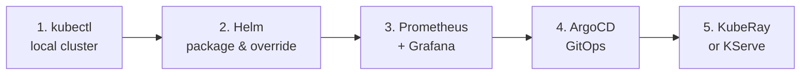

# Reading path

Five things to actually touch, in order. One weekend each.

1. **kubectl** against a local cluster (kind, k3d). Deploy a FastAPI inference server. Read its logs.
2. **Helm**. Package the same app. Override values for a second environment.
3. **Prometheus and Grafana**. Scrape one metric. Build one dashboard. Set one alert.
4. **ArgoCD**. Put your Helm chart in a git repo. Deploy by merging a PR.
5. **An operator**. Pick KubeRay or KServe. Run a training job or serve a model declaratively.

After this, the rest of cloud native is variations on patterns you've already touched.

---

[Back to landscape](../README.md)
