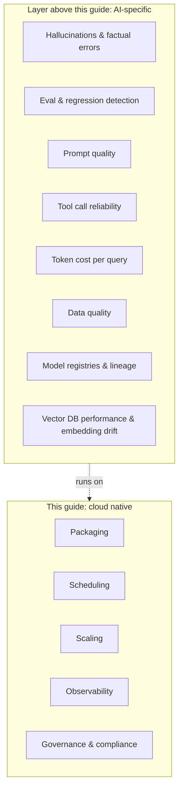

# Where cloud native doesn't help

A field guide is only credible if it admits its limits. Cloud native answers a specific class of problems: packaging, scheduling, scaling, network, observability, governance, compliance. There's another class it has nothing useful to say about. Knowing the difference saves you from forcing a Kubernetes-shaped answer onto a non-Kubernetes-shaped problem.

Cloud native does not help with:

- **Hallucinations and factual errors.** No primitive in this guide makes your model more truthful. That's prompt engineering, retrieval design, fine-tuning, eval.
- **Eval and regression detection.** Did the new model just get worse at your top intent? CN doesn't know. Eval frameworks (LangSmith, Langfuse, Inspect, your own harness) own this layer.
- **Prompt quality.** CN can version your prompts and ship them safely. It can't tell you whether they're any good.
- **Tool call reliability and structured output.** Whether your LLM emits valid JSON to a tool 99% of the time or 80% of the time is a model and prompt problem, not a platform problem.
- **Token cost per query.** Sometimes the answer is a smaller model, a different model, more caching, less context. CN can show you the bill; it can't pick the trade-off.
- **Data quality.** Garbage in, garbage out is older than Kubernetes and unfixable by it.
- **Model registries, experiment tracking, lineage.** Closer to CN's neighborhood, but the canonical tools are MLflow, Weights and Biases, DVC. CN gives them somewhere to run; it doesn't replace them.
- **Vector database performance and embedding drift.** Operating Weaviate, Qdrant, or Milvus on Kubernetes is solved. Making retrieval actually good is not.

A working AI system needs both layers: the one this guide covers, and the one it doesn't. Don't expect either to do the other's job.

---

[Back to landscape](../README.md)
